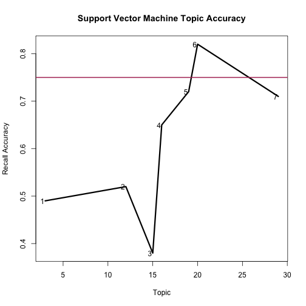
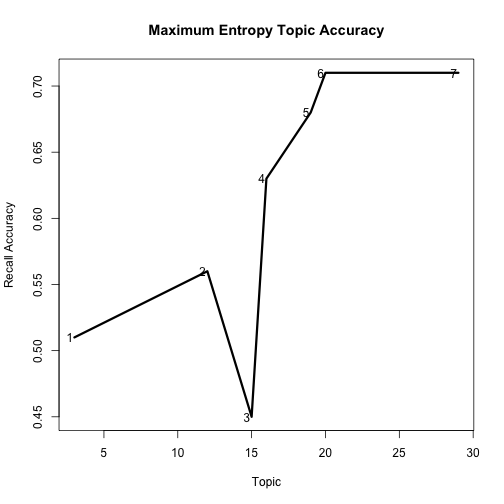

# Document-level text analysis

Document-level analysis is when you are interested in the whole text article, not tokens (sentences or words).  The most basic example is labeling documents against some classification scheme, hence **text classification**.  When you don't know your scheme ahead of time or you're interested in exploring a large set of data, you can try **topic modeling**.

We're going to go over a couple of examples of document-level text analysis using some very most common classifiers models.  We're going to go over the code to train your own model and discuss the results we see.

## Supervised learning: Text classification in R

We're going to go over examples of how to use the excellent [RTextTools](http://www.rtexttools.com/) library to train some text classifiers.

The dataset used are the titles and topic codes from the `NYTimes` dataset that comes with the RTextTools library in `R`.  It consists of titles from NYTimes front page news and associated codes according to [Amber Boydstun's classification scheme](http://www.policyagendas.org/sites/policyagendas.org/files/Boydstun_NYT_FrontPage_Codebook_0.pdf).


```
## Loading required package: SparseM
## 
## Attaching package: 'SparseM'
## 
## The following object is masked from 'package:base':
## 
## backsolve
## 
## Loading required package: randomForest randomForest 4.6-7 Type rfNews() to
## see new features/changes/bug fixes. Loading required package: tree Loading
## required package: nnet Loading required package: tm Loading required
## package: e1071 Loading required package: class Loading required package:
## ipred KernSmooth 2.23 loaded Copyright M. P. Wand 1997-2009 Loading
## required package: caTools Loading required package: maxent Loading
## required package: Rcpp Loading required package: glmnet Loading required
## package: Matrix Loading required package: lattice
## 
## Attaching package: 'Matrix'
## 
## The following object is masked from 'package:SparseM':
## 
## det
## 
## Loaded glmnet 1.9-5
## 
## Loading required package: tau
```


```r
# Code adapted from Collingwood and Jurka

# READ THE CSV DATA from the RTextTools package Note that RTextTools has
# many dependencies, but Collingwood & Jurka [wisely] chose to keep all the
# dependencies R-friendly (read, no Java that I know of).
data(NYTimes)

# there isn't that much data in this dataset for training so we're going to
# subset down only to those data that contain a lot of observations
table(NYTimes$Topic.Code)
```

```
## 
##   1   2   3   4   5   6   7   8  10  12  13  14  15  16  17  18  19  20 
##  71  88 185  19  83  87  34  33  50 163  22  40 172 444  81  16 662 394 
##  21  24  26  27  28  29  30  31  99 
##  20  76  47  11  75 141  29  41  20
```

```r
# consider only using 3, 12, 15, 16, 19, 20, 29
valid = c(3, 12, 15, 16, 19, 20, 29)
NYTimes = NYTimes[NYTimes$Topic.Code %in% valid, ]
table(NYTimes$Topic.Code)
```

```
## 
##   3  12  15  16  19  20  29 
## 185 163 172 444 662 394 141
```

```r
num_documents = dim(NYTimes)[1]

# Examine the data
class(NYTimes)  #make sure it is a data frame object
```

```
## [1] "data.frame"
```

```r
head(NYTimes)  # Look at the first six lines or so
```

```
##   Article_ID      Date
## 1      41246  1-Jan-96
## 2      41257  2-Jan-96
## 3      41268  3-Jan-96
## 4      41279  4-Jan-96
## 6      41302  7-Jan-96
## 9      41344 11-Jan-96
##                                                                 Title
## 1       Nation's Smaller Jails Struggle To Cope With Surge in Inmates
## 2                     FEDERAL IMPASSE SADDLING STATES WITH INDECISION
## 3 Long, Costly Prelude Does Little To Alter Plot of Presidential Race
## 4        Top Leader of the Bosnian Serbs Now Under Attack From Within
## 6                     South African Democracy Stumbles on Old Rivalry
## 9                                 High Court Is Cool To Census Change
##                                      Subject Topic.Code
## 1  Jails overwhelmed with hardened criminals         12
## 2    Federal budget impasse affect on states         20
## 3 Contenders for 1996 Presedential elections         20
## 4 Bosnian Serb leader criticized from within         19
## 6         political violence in south africa         19
## 9                             census changes         20
```

```r
summary(NYTimes)  #summarize the data
```

```
##    Article_ID           Date     
##  Min.   : 5469   29-Sep-99:   2  
##  1st Qu.:19551   1-Apr-00 :   1  
##  Median :28163   1-Apr-01 :   1  
##  Mean   :27616   1-Apr-03 :   1  
##  3rd Qu.:37194   1-Apr-04 :   1  
##  Max.   :45716   1-Apr-05 :   1  
##                  (Other)  :2154  
##                                    Title                   Subject    
##  CRISIS IN THE BALKANS: THE OVERVIEW; :   6   baseball         :  10  
##  TESTING OF A PRESIDENT: THE OVERVIEW;:   5   Enron scandal    :   5  
##  INTERNATIONAL BUSINESS;              :   4   olympics         :   5  
##  STANDOFF WITH IRAQ: THE OVERVIEW;    :   3   tennis           :   4  
##  BASEBALL PLAYOFFS                    :   2   2000 campaign    :   3  
##  BASEBALL;                            :   2   baseball playoffs:   3  
##  (Other)                              :2139   (Other)          :2131  
##    Topic.Code
##  Min.   : 3  
##  1st Qu.:16  
##  Median :19  
##  Mean   :17  
##  3rd Qu.:19  
##  Max.   :29  
## 
```

```r
sapply(NYTimes, class)  #look at the class of each column
```

```
## Article_ID       Date      Title    Subject Topic.Code 
##  "integer"   "factor"   "factor"   "factor"  "integer"
```

```r
dim(NYTimes)  #Check the dimensions, rows and columns
```

```
## [1] 2161    5
```

```r

# [OPTIONAL] SUBSET YOUR DATA TO GET A RANDOM SAMPLE we don't have that much
# data, so we're going to keep it all sample_size = 500
sample_size = num_documents
NYT_sample <- NYTimes[sample(1:num_documents, size = sample_size, replace = FALSE), 
    ]

out_data = data.frame(NYT_sample$Topic.Code, NYT_sample$Title)
write.csv(out_data, "nyt_title_data.csv", row.names = F)

# CREATE A TERM-DOCUMENT MATRIX THAT REPRESENTS WORD FREQUENCIES IN EACH
# DOCUMENT WE WILL TRAIN ON THE Title COLUMNS NYT_dtm <-
# create_matrix(data.frame(NYT_sample$Title,NYT_sample$Subject),
NYT_dtm <- create_matrix(as.vector(NYT_sample$Title), language = "english", 
    removeNumbers = TRUE, stemWords = TRUE, weighting = weightTfIdf)

NYT_dtm  # Sparse Matrix object
```

```
## A document-term matrix (2161 documents, 3437 terms)
## 
## Non-/sparse entries: 12285/7415072
## Sparsity           : 100%
## Maximal term length: 16 
## Weighting          : term frequency - inverse document frequency (normalized) (tf-idf)
```

```r

# CORPUS AND CONTAINER CREATION

# choosing the right size of training/test data is a personal decision let's
# go with an 80/20 split; this is quite common
train_n = round(sample_size * 0.8)
test_n = round(sample_size * 0.2)

corpus <- create_container(NYT_dtm, NYT_sample$Topic.Code, trainSize = 1:train_n, 
    testSize = (train_n + 1):sample_size, virgin = FALSE)

names(attributes(corpus))
```

```
## [1] "training_matrix"       "classification_matrix" "training_codes"       
## [4] "testing_codes"         "column_names"          "virgin"               
## [7] "class"
```

```r
paste(NYT_sample[1, ]$Title)  # original data
```

```
## [1] "ISRAELIS BATTER GAZA AND SEIZE HAMAS OFFICIALS"
```

```r
corpus@column_names[corpus@training_matrix[1]@ja]  # preprocessed data
```

```
## [1] "batter" "gaza"   "hama"   "isra"   "offici" "seiz"
```

```r

# TRAIN MODELS
models <- train_models(corpus, algorithms = c("SVM", "MAXENT"))
results <- classify_models(corpus, models)
analytics <- create_analytics(corpus, results)

nyt_codes = read.csv("../data/nytimes_codes.csv")
test_start_index = num_documents - train_n
svm_full = data.frame(NYT_sample[1730:2161, ]$Title, results$SVM_LABEL)
maxent_full = data.frame(NYT_sample[1730:2161, ]$Title, results$MAXENTROPY_LABEL)

names(svm_full) = c("content", "code")
names(maxent_full) = c("content", "code")
svm_full = merge(svm_full, nyt_codes)
maxent_full = merge(maxent_full, nyt_codes)

# lets take a random sample of each of these and ask people to verify the
# coding

svm_mozfest = svm_full[sample(1:432, size = 100, replace = FALSE), ]
maxent_mozfest = maxent_full[sample(1:432, size = 100, replace = FALSE), ]

write.csv(svm_mozfest, "../labeling_examples/svm_mozfest.csv", row.names = FALSE)
write.csv(maxent_mozfest, "../labeling_examples/maxent_mozfest.csv", row.names = FALSE)
```


```r
# SUMMARY OF PRECISION, RECALL, F-SCORES, AND ACCURACY SORTED BY TOPIC CODE
# FOR EACH ALGORITHM
analytics@algorithm_summary
```

```
##    SVM_PRECISION SVM_RECALL SVM_FSCORE MAXENTROPY_PRECISION
## 3           0.79       0.49       0.60                 0.63
## 12          0.44       0.52       0.48                 0.40
## 15          0.32       0.38       0.35                 0.50
## 16          0.67       0.65       0.66                 0.54
## 19          0.66       0.72       0.69                 0.71
## 20          0.82       0.82       0.82                 0.86
## 29          0.74       0.71       0.72                 1.00
##    MAXENTROPY_RECALL MAXENTROPY_FSCORE
## 3               0.53              0.58
## 12              0.44              0.42
## 15              0.54              0.52
## 16              0.75              0.63
## 19              0.64              0.67
## 20              0.76              0.81
## 29              0.68              0.81
```

```r
# SUMMARY OF LABEL (e.g. TOPIC) ACCURACY analytics@label_summary RAW SUMMARY
# OF ALL DATA AND SCORING analytics@document_summary
```


```r
x <- as.character(rownames(analytics@algorithm_summary))[-20]
y <- analytics@algorithm_summary$SVM_RECALL[-20]
plot(x, y, type = "l", lwd = 3, main = "Support Vector Machine Topic Accuracy", 
    ylab = "Recall Accuracy", xlab = "Topic")
abline(h = 0.75, lwd = 2, col = "maroon")
text(x, y, adj = 1.2)
```

 

```r

x <- as.character(rownames(analytics@algorithm_summary))[-20]
y <- analytics@algorithm_summary$MAXENTROPY_RECALL[-20]
plot(x, y, type = "l", lwd = 3, main = "Maximum Entropy Topic Accuracy", ylab = "Recall Accuracy", 
    xlab = "Topic")
abline(h = 0.75, lwd = 2, col = "maroon")
text(x, y, adj = 1.2)
```

 


## Unsupervised learning: topic modeling


```r
library(topicmodels)

#term frequency vectors, not tf-idf vectors
n_topics = 20
NYT_dtm <- create_matrix(as.vector(NYT_sample$Title), 
                         language="english", 
                         removeNumbers=FALSE, 
                         stemWords=FALSE, #only because they are short 
                         weighting=weightTf)

rowTotals <- apply(NYT_dtm , 1, sum)
NYT_dtm_full   <- NYT_dtm[rowTotals> 0]  

k <- length(unique(NYT_sample$Topic.Code))
lda <- LDA(NYT_dtm_full, k)


data("AssociatedPress", package = "topicmodels")
lda <- LDA(AssociatedPress[1:1000,], control = list(alpha = 0.1), k = 20)
lda_inf <- posterior(lda, AssociatedPress[21:30,])
```

