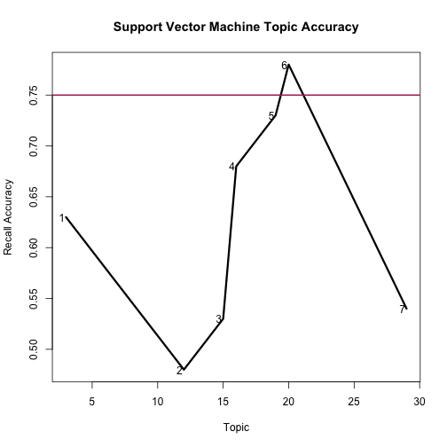
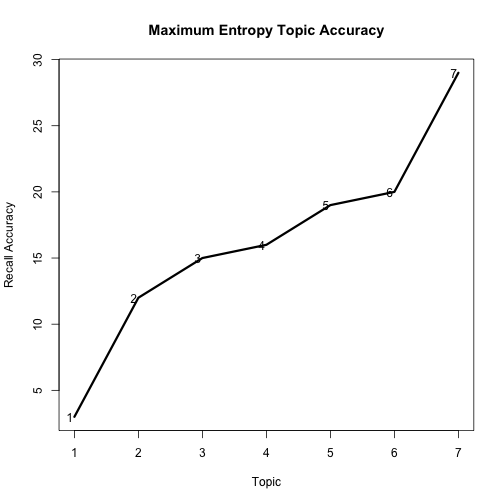

Notes from MozFest Workshop
========================================================


```r
library(plyr)
library(reshape2)
setwd("/Users/rweiss/Dropbox/presentations/MozFest2013/data/")
```


# Sentiment

```r
# Using Tim Jurka's sentiment package
library(sentiment)
```

```
## Loading required package: tm Loading required package: Rstem
```

```r

rt_neg = read.delim("rt-polaritydata/rt-polaritydata/rt-polarity.neg", header = F)
```

```
## Warning: cannot open file
## 'rt-polaritydata/rt-polaritydata/rt-polarity.neg': No such file or
## directory
```

```
## Error: cannot open the connection
```

```r
rt_pos = read.delim("rt-polaritydata/rt-polaritydata/rt-polarity.pos", header = F)
```

```
## Warning: cannot open file
## 'rt-polaritydata/rt-polaritydata/rt-polarity.pos': No such file or
## directory
```

```
## Error: cannot open the connection
```

```r
rt_neg = data.frame(rt_neg)
```

```
## Error: object 'rt_neg' not found
```

```r
rt_pos = data.frame(rt_pos)
```

```
## Error: object 'rt_pos' not found
```

```r
rt_neg$label = "negative"
```

```
## Error: object 'rt_neg' not found
```

```r
rt_pos$label = "positive"
```

```
## Error: object 'rt_pos' not found
```

```r
reviews = rbind(rt_neg, rt_pos)
```

```
## Error: object 'rt_neg' not found
```

```r
names(reviews) = c("content", "label")
```

```
## Error: object 'reviews' not found
```

```r

# let's start off with a small sample
sample_size = 100
num_documents = dim(reviews)[1]
```

```
## Error: object 'reviews' not found
```

```r
reviews_sample <- reviews[sample(1:num_documents, size = sample_size, replace = FALSE), 
    ]
```

```
## Error: object 'reviews' not found
```

```r

# let's save this so we can compare it against the SASA tool
# write.csv(reviews_sample$content, 'reviews_data.csv', row.names=F,
# col.names=F) write.csv(reviews_sample, 'reviews_sample.csv')

class(reviews_sample)  #make sure it is a data frame object
```

```
## Error: object 'reviews_sample' not found
```

```r
head(reviews_sample)  # Look at the first six lines or so
```

```
## Error: object 'reviews_sample' not found
```

```r
summary(reviews_sample)  #summarize the data
```

```
## Error: object 'reviews_sample' not found
```

```r
sapply(reviews_sample, class)  #look at the class of each column
```

```
## Error: object 'reviews_sample' not found
```

```r
dim(reviews_sample)  #Check the dimensions, rows and columns
```

```
## Error: object 'reviews_sample' not found
```

```r

predicted_sentiment = ddply(reviews_sample, .(content), function(x) {
    classify_polarity(x, algorithm = "bayes")
})
```

```
## Error: object 'reviews_sample' not found
```

```r

table(reviews_sample$label)
```

```
## Error: object 'reviews_sample' not found
```

```r

predicted_sentiment$"POS/NEG" = as.numeric(as.character(predicted_sentiment$"POS/NEG"))
```

```
## Error: object 'predicted_sentiment' not found
```

```r
predicted_sentiment$label = cut(predicted_sentiment$"POS/NEG", breaks = c(0, 
    1, max(predicted_sentiment$"POS/NEG")))
```

```
## Error: object 'predicted_sentiment' not found
```

```r
levels(predicted_sentiment$label) = c("negative", "positive")
```

```
## Error: object 'predicted_sentiment' not found
```

```r
number_correct = sum(predicted_sentiment$label == reviews_sample$label)
```

```
## Error: object 'predicted_sentiment' not found
```

```r
number_correct/sample_size
```

```
## Error: object 'number_correct' not found
```

```r

table(reviews_sample$label)
```

```
## Error: object 'reviews_sample' not found
```

```r
table(predicted_sentiment$label)
```

```
## Error: object 'predicted_sentiment' not found
```

```r
reviews_labeled = data.frame(predicted_sentiment$label, predicted_sentiment$content)
```

```
## Error: object 'predicted_sentiment' not found
```

```r
write.csv(reviews_labeled, "reviews_sample_2.csv", row.names = F)
```

```
## Error: object 'reviews_labeled' not found
```


#Document Labels

```r
# Adapted from Collingwood and Jurka's READ THE CSV DATA from the RTextTools
# package
library(RTextTools)
```

```
## Loading required package: SparseM
```

```
## Warning: package 'SparseM' was built under R version 3.0.1
```

```
## Attaching package: 'SparseM'
## 
## The following object is masked from 'package:base':
## 
## backsolve
## 
## Loading required package: randomForest randomForest 4.6-7 Type rfNews() to
## see new features/changes/bug fixes. Loading required package: tree Loading
## required package: nnet Loading required package: e1071 Loading required
## package: class
```

```
## Warning: package 'class' was built under R version 3.0.1
```

```
## Loading required package: ipred
```

```
## Warning: package 'ipred' was built under R version 3.0.1
```

```
## KernSmooth 2.23 loaded Copyright M. P. Wand 1997-2009 Loading required
## package: caTools Loading required package: maxent Loading required
## package: Rcpp
```

```
## Warning: replacing previous import 'coerce' when loading 'SparseM'
```

```
## Loading required package: glmnet
```

```
## Warning: package 'glmnet' was built under R version 3.0.1
```

```
## Loading required package: Matrix
```

```
## Warning: package 'Matrix' was built under R version 3.0.1
```

```
## Loading required package: lattice
```

```
## Warning: package 'lattice' was built under R version 3.0.1
```

```
## Attaching package: 'Matrix'
## 
## The following object is masked from 'package:SparseM':
## 
## det
## 
## Loaded glmnet 1.9-5
## 
## Loading required package: tau
```

```
## Warning: replacing previous import 'coerce' when loading 'SparseM'
```

```
## Attaching package: 'RTextTools'
## 
## The following object is masked from 'package:sentiment':
## 
## create_matrix
## 
## The following object is masked from 'package:Rstem':
## 
## getStemLanguages, wordStem
```

```r
data(NYTimes)
dim(NYTimes)
```

```
## [1] 3104    5
```

```r
head(NYTimes)
```

```
##   Article_ID     Date
## 1      41246 1-Jan-96
## 2      41257 2-Jan-96
## 3      41268 3-Jan-96
## 4      41279 4-Jan-96
## 5      41290 5-Jan-96
## 6      41302 7-Jan-96
##                                                                                     Title
## 1                           Nation's Smaller Jails Struggle To Cope With Surge in Inmates
## 2                                         FEDERAL IMPASSE SADDLING STATES WITH INDECISION
## 3                     Long, Costly Prelude Does Little To Alter Plot of Presidential Race
## 4                            Top Leader of the Bosnian Serbs Now Under Attack From Within
## 5 BATTLE OVER THE BUDGET: THE OVERVIEW; LEADERS IN HOUSE DROP G.O.P. PLAN ON U.S. WORKERS
## 6                                         South African Democracy Stumbles on Old Rivalry
##                                                                                      Subject
## 1                                                  Jails overwhelmed with hardened criminals
## 2                                                    Federal budget impasse affect on states
## 3                                                 Contenders for 1996 Presedential elections
## 4                                                 Bosnian Serb leader criticized from within
## 5 Battle over budget: Republican leaders abandon strategy of using closed Government offices
## 6                                                         political violence in south africa
##   Topic.Code
## 1         12
## 2         20
## 3         20
## 4         19
## 5          1
## 6         19
```

```r

valid = c(3, 12, 15, 16, 19, 20, 29)
NYTimes = NYTimes[NYTimes$Topic.Code %in% valid, ]
# consider only using 3, 12, 15, 16, 19, 20, 29
num_documents = dim(NYTimes)[1]

# Examine the data
class(NYTimes)  #make sure it is a data frame object
```

```
## [1] "data.frame"
```

```r
head(NYTimes)  # Look at the first six lines or so
```

```
##   Article_ID      Date
## 1      41246  1-Jan-96
## 2      41257  2-Jan-96
## 3      41268  3-Jan-96
## 4      41279  4-Jan-96
## 6      41302  7-Jan-96
## 9      41344 11-Jan-96
##                                                                 Title
## 1       Nation's Smaller Jails Struggle To Cope With Surge in Inmates
## 2                     FEDERAL IMPASSE SADDLING STATES WITH INDECISION
## 3 Long, Costly Prelude Does Little To Alter Plot of Presidential Race
## 4        Top Leader of the Bosnian Serbs Now Under Attack From Within
## 6                     South African Democracy Stumbles on Old Rivalry
## 9                                 High Court Is Cool To Census Change
##                                      Subject Topic.Code
## 1  Jails overwhelmed with hardened criminals         12
## 2    Federal budget impasse affect on states         20
## 3 Contenders for 1996 Presedential elections         20
## 4 Bosnian Serb leader criticized from within         19
## 6         political violence in south africa         19
## 9                             census changes         20
```

```r
summary(NYTimes)  #summarize the data
```

```
##    Article_ID           Date     
##  Min.   : 5469   29-Sep-99:   2  
##  1st Qu.:19551   1-Apr-00 :   1  
##  Median :28163   1-Apr-01 :   1  
##  Mean   :27616   1-Apr-03 :   1  
##  3rd Qu.:37194   1-Apr-04 :   1  
##  Max.   :45716   1-Apr-05 :   1  
##                  (Other)  :2154  
##                                    Title                   Subject    
##  CRISIS IN THE BALKANS: THE OVERVIEW; :   6   baseball         :  10  
##  TESTING OF A PRESIDENT: THE OVERVIEW;:   5   Enron scandal    :   5  
##  INTERNATIONAL BUSINESS;              :   4   olympics         :   5  
##  STANDOFF WITH IRAQ: THE OVERVIEW;    :   3   tennis           :   4  
##  BASEBALL PLAYOFFS                    :   2   2000 campaign    :   3  
##  BASEBALL;                            :   2   baseball playoffs:   3  
##  (Other)                              :2139   (Other)          :2131  
##    Topic.Code
##  Min.   : 3  
##  1st Qu.:16  
##  Median :19  
##  Mean   :17  
##  3rd Qu.:19  
##  Max.   :29  
## 
```

```r
sapply(NYTimes, class)  #look at the class of each column
```

```
## Article_ID       Date      Title    Subject Topic.Code 
##  "integer"   "factor"   "factor"   "factor"  "integer"
```

```r
dim(NYTimes)  #Check the dimensions, rows and columns
```

```
## [1] 2161    5
```

```r

# [OPTIONAL] SUBSET YOUR DATA TO GET A RANDOM SAMPLE sample_size = 500
sample_size = num_documents
NYT_sample <- NYTimes[sample(1:num_documents, size = sample_size, replace = FALSE), 
    ]


# CREATE A TERM-DOCUMENT MATRIX THAT REPRESENTS WORD FREQUENCIES IN EACH
# DOCUMENT WE WILL TRAIN ON THE Title COLUMNS NYT_dtm <-
# create_matrix(data.frame(NYT_sample$Title,NYT_sample$Subject),
NYT_dtm <- create_matrix(as.vector(NYT_sample$Title), language = "english", 
    removeNumbers = TRUE, stemWords = TRUE, weighting = weightTfIdf)
```

```
## Warning: empty document(s): No
```

```r

NYT_dtm  # Sparse Matrix object
```

```
## A document-term matrix (2161 documents, 3437 terms)
## 
## Non-/sparse entries: 12285/7415072
## Sparsity           : 100%
## Maximal term length: 16 
## Weighting          : term frequency - inverse document frequency (normalized) (tf-idf)
```

```r

######################################## CORPUS AND CONTAINER CREATION #

train_n = round(sample_size * 0.8)
test_n = round(sample_size * 0.2)

corpus <- create_container(NYT_dtm, NYT_sample$Topic.Code, trainSize = 1:train_n, 
    testSize = (train_n + 1):sample_size, virgin = FALSE)

names(attributes(corpus))  #class matrix_container
```

```
## [1] "training_matrix"       "classification_matrix" "training_codes"       
## [4] "testing_codes"         "column_names"          "virgin"               
## [7] "class"
```

```r
paste(NYT_sample[1, ]$Title)
```

```
## [1] "For City Kept Sleepless by Colic, No End to Cures in Melting Pot"
```

```r
corpus@column_names[corpus@training_matrix[1]@ja]
```

```
## [1] "citi"      "colic"     "cure"      "end"       "kept"      "melt"     
## [7] "pot"       "sleepless"
```

```r

############################## TRAIN MODELS #

models <- train_models(corpus, algorithms = c("SVM", "MAXENT"))
results <- classify_models(corpus, models)
analytics <- create_analytics(corpus, results)

nyt_codes = read.csv("nytimes_codes.csv")
```

```
## Warning: cannot open file 'nytimes_codes.csv': No such file or directory
```

```
## Error: cannot open the connection
```

```r

svm_full = data.frame(NYT_sample[1730:2161, ]$Title, results$SVM_LABEL)
maxent_full = data.frame(NYT_sample[1730:2161, ]$Title, results$MAXENTROPY_LABEL)

names(svm_full) = c("content", "code")
names(maxent_full) = c("content", "code")
svm_full = merge(svm_full, nyt_codes)
```

```
## Error: object 'nyt_codes' not found
```

```r
maxent_full = merge(maxent_full, nyt_codes)
```

```
## Error: object 'nyt_codes' not found
```

```r

# lets take a random sample of each of these and ask people to code them

# svm_mozfest = svm_full[sample(1:432,size=100,replace=FALSE),]
# maxent_mozfest = maxent_full[sample(1:432,size=100,replace=FALSE),]

# write.csv(svm_mozfest, 'svm_mozfest.csv', row.names=FALSE)
# write.csv(maxent_mozfest,'maxent_mozfest.csv', row.names=FALSE)

# RESULTS WILL BE REPORTED BACK IN THE analytics VARIABLE. SUMMARY OF
# PRECISION, RECALL, F-SCORES, AND ACCURACY SORTED BY TOPIC CODE FOR EACH
# ALGORITHM
analytics@algorithm_summary
```

```
##    SVM_PRECISION SVM_RECALL SVM_FSCORE MAXENTROPY_PRECISION
## 3           0.65       0.63       0.64                 0.64
## 12          0.50       0.48       0.49                 0.48
## 15          0.56       0.53       0.54                 0.56
## 16          0.66       0.68       0.67                 0.53
## 19          0.68       0.73       0.70                 0.70
## 20          0.80       0.78       0.79                 0.82
## 29          0.76       0.54       0.63                 0.88
##    MAXENTROPY_RECALL MAXENTROPY_FSCORE
## 3               0.60              0.62
## 12              0.52              0.50
## 15              0.53              0.54
## 16              0.67              0.59
## 19              0.66              0.68
## 20              0.77              0.79
## 29              0.58              0.70
```

```r
# SUMMARY OF LABEL (e.g. TOPIC) ACCURACY analytics@label_summary RAW SUMMARY
# OF ALL DATA AND SCORING analytics@document_summary

x <- as.numeric(rownames(analytics@algorithm_summary))[-20]
y <- analytics@algorithm_summary$SVM_RECALL[-20]
plot(x, y, type = "l", lwd = 3, main = "Support Vector Machine Topic Accuracy", 
    ylab = "Recall Accuracy", xlab = "Topic")
abline(h = 0.75, lwd = 2, col = "maroon")
text(x, y, adj = 1.2)
```

 

```r

x <- as.numeric(rownames(analytics@algorithm_summary))[-20]
y <- analytics@algorithm_summary$MAXENT_RECALL[-20]
plot(x, y, type = "l", lwd = 3, main = "Maximum Entropy Topic Accuracy", ylab = "Recall Accuracy", 
    xlab = "Topic")
abline(h = 0.75, lwd = 2, col = "maroon")
text(x, y, adj = 1.2)
```

 

